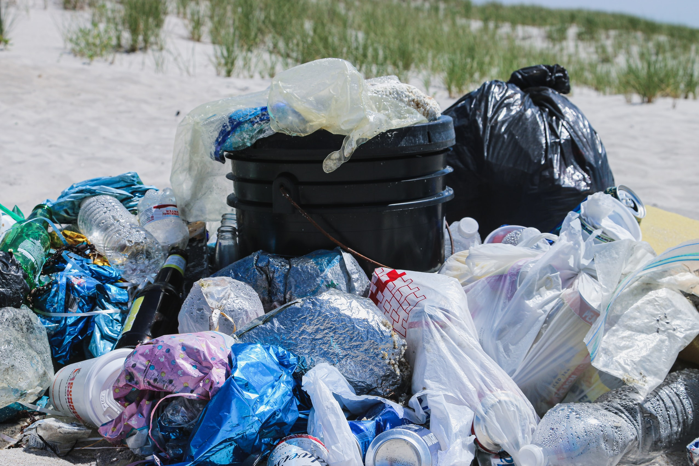
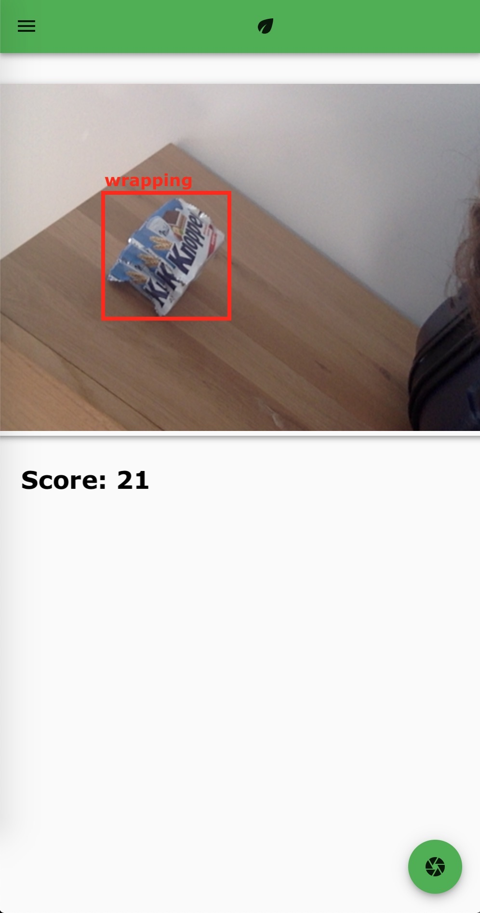
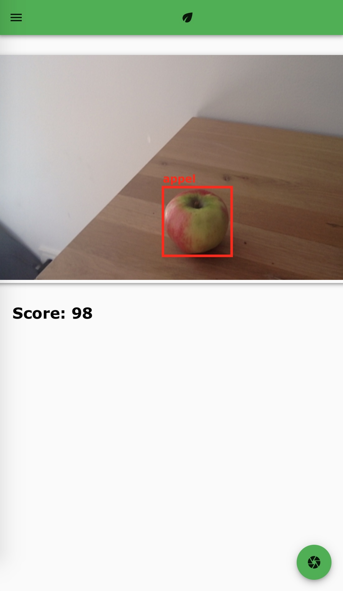

# wrappr
Note: Fabian - Plastikmüll erkennen und Probleme

---

## Plastikmüll

Note: Generelles Problem - viel Plastik Müll - Aufmerksamkeit generieren 

---

Anwendung

---

---

## Technologie

---

## ML braucht Daten